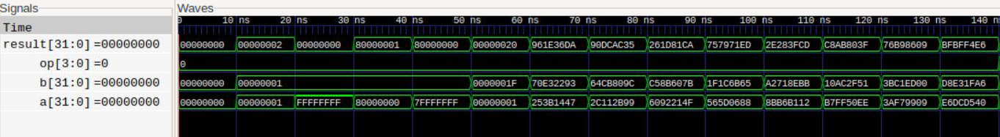
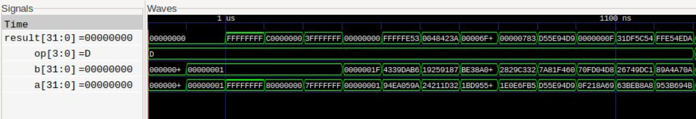

# RV32I ALU (VHDL)

A 32-bit ALU implementing the RV32I integer register-register operations,
designed to minimize hardware by sharing datapath resources. Includes a
self-checking testbench that compares every operation against an independent
behavioral reference model.

- 10 operations: `ADD SUB SLL SLT SLTU XOR SRL SRA OR AND`
- Purely combinational, no clock, no vendor primitives (portable VHDL-2008)
- Opcode bits map directly onto RISC-V instruction fields
- Simulates with [GHDL](https://github.com/ghdl/ghdl), no proprietary tools needed

## Design highlights

- **One adder for four operations.** ADD, SUB, SLT, and SLTU all use a single
  34-bit add. Subtraction inverts `b` and injects the +1 as a carry-in by
  appending a bit to both operands. SLTU is the inverted carry-out; SLT is the
  sign bit of the difference, corrected for the case where operand signs differ
  (where overflow would otherwise give the wrong answer).
- **One barrel shifter for three operations.** SLL, SRL, and SRA share a
  5-stage logarithmic right shifter (shifts by 1, 2, 4, 8, 16, each stage
  enabled by one bit of `b[4:0]`). Left shifts reverse the input bits, shift
  right, and reverse the result, so no separate left-shift hardware is needed.
  SRA differs from SRL only in the fill bit.
- **Opcode = instruction fields.** `op(3)` is `funct7[5]` and `op(2:0)` is
  `funct3`, so the decoder can feed the ALU directly from the instruction.
- **Zero flag** on every result, usable for BEQ/BNE via SUB.

### How the shared adder works

The adder computes `a + (b or ~b) + carry_in` as one 34-bit addition:

```
adder_r = {0, a, is_sub} + {0, adder_b, is_sub}
           ^^^^^^^^^^^^^^   bit 0 is the carry-in trick: is_sub + is_sub
                            generates a carry into bit 1 exactly when is_sub = 1
```

| Bits of `adder_r` | Meaning                                      |
|-------------------|----------------------------------------------|
| `[32:1]`          | 32-bit sum / difference (ADD, SUB result)    |
| `[33]`            | Carry-out; `0` means a borrow, i.e. `a < b` unsigned (SLTU) |
| `[32]`            | Sign bit of the difference (used for SLT)    |

`is_sub = op(3) or op(1)`, which selects subtraction for SUB (`1000`), SLT
(`0010`), and SLTU (`0011`).

**SLT correction.** If `a` and `b` have the same sign, the difference cannot
overflow, so its sign bit is the answer. If the signs differ, the difference
may overflow, but the answer is simply "`a` is negative", so `a(31)` is used
directly.

### How the shared shifter works

```
 a ──► [reverse if SLL] ──► 5-stage right shifter ──► [reverse if SLL] ──► result
                              (1, 2, 4, 8, 16)
                              fill = op(3) AND a(31)
```

- `op(2) = 1` (SRL, SRA) means shift right directly; `op(2) = 0` (SLL) wraps
  the shifter in two bit-reversals.
- The fill bit is `op(3) and a(31)`: sign-extend for SRA (`1101`), zero for
  SRL and SLL (where `op(3) = 0`).

## Operations

| op     | Operation | Result                          |
|--------|-----------|---------------------------------|
| `0000` | ADD       | a + b                           |
| `1000` | SUB       | a − b                           |
| `0001` | SLL       | a << b[4:0]                     |
| `0010` | SLT       | signed(a) < signed(b)           |
| `0011` | SLTU      | unsigned(a) < unsigned(b)       |
| `0100` | XOR       | a xor b                         |
| `0101` | SRL       | a >> b[4:0] (logical)           |
| `1101` | SRA       | a >> b[4:0] (arithmetic)        |
| `0110` | OR        | a or b                          |
| `0111` | AND       | a and b                         |

Any other `op` value outputs `0x00000000` (and therefore `zero = 1`).

## Interface

| Port     | Dir | Width | Description                  |
|----------|-----|-------|------------------------------|
| `a`, `b` | in  | 32    | Operands                     |
| `op`     | in  | 4     | Operation select (see above) |
| `result` | out | 32    | Result                       |
| `zero`   | out | 1     | High when `result` is zero   |

### Using it in a datapath

- **R-type:** wire `op <= instr(30) & instr(14 downto 12)`.
- **I-type (ADDI, SLTI, XORI, ...):** there is no SUBI, and `instr(30)` is part
  of the immediate, so force `op(3) = '0'` for every I-type ALU instruction
  *except* SRAI, where `op(3) = instr(30)`. Otherwise an immediate with bit 30
  set would be decoded as SUB/SRA.
- **Branches:** BEQ/BNE use `SUB` and the `zero` flag; BLT/BGE use `SLT`; BLTU/BGEU
  use `SLTU`.
- **Address calculation** (loads, stores, AUIPC, JALR): use `ADD`.

## Simulation

Requires [GHDL](https://github.com/ghdl/ghdl) with VHDL-2008 support.

```sh
ghdl -a --std=08 src/rv32i_alu.vhdl tb/rv32i_alu_tb.vhdl
ghdl -r --std=08 rv32i_alu_tb
```

To dump a waveform and view it in [GTKWave](https://gtkwave.sourceforge.net/):

```sh
ghdl -r --std=08 rv32i_alu_tb --wave=alu.ghw
gtkwave alu.ghw
```

## Verification

The testbench (`tb/rv32i_alu_tb.vhdl`) is self-checking: it needs no waveform
inspection to know whether the design is correct.

**Method**

- For each of the 10 operations it applies **6 directed corner-case vectors**
  and **8 pseudo-random vectors** (140 checks total).
- Each vector checks **both** `result` and `zero` against a behavioral reference
  model written with `numeric_std` operators (`+`, `-`, `shift_left`,
  `shift_right`, `<`). The model deliberately shares no structure with the ALU
  (no shared adder, no bit reversal), so it is an independent cross-check
  rather than a copy of the implementation.
- The random seed is fixed, so every run applies identical vectors and results
  are reproducible.
- A mismatch is logged with the operation name, both operands, and the actual
  vs. expected result; the run continues so every failure is reported.

**Directed vectors (applied to every operation)**

| `a`          | `b`          | Why                                              |
|--------------|--------------|--------------------------------------------------|
| `0x00000000` | `0x00000000` | All zeros, exercises the zero flag               |
| `0x00000001` | `0x00000001` | Smallest nonzero operands, SUB/XOR give zero     |
| `0xFFFFFFFF` | `0x00000001` | Wraparound; −1 as signed                         |
| `0x80000000` | `0x00000001` | Most negative signed value; SRA sign fill        |
| `0x7FFFFFFF` | `0x00000001` | Most positive signed value; signed overflow on ADD |
| `0x00000001` | `0x0000001F` | Maximum shift amount (31)                        |

**Example output** (abridged; GHDL prefixes each line with file/time info)

```
rv32i_alu_tb.vhdl:211:9:@140ns:(report note): Section ADD  : 14/14 PASS
rv32i_alu_tb.vhdl:211:9:@280ns:(report note): Section SUB  : 14/14 PASS
rv32i_alu_tb.vhdl:211:9:@420ns:(report note): Section SLL  : 14/14 PASS
rv32i_alu_tb.vhdl:211:9:@560ns:(report note): Section SLT  : 14/14 PASS
rv32i_alu_tb.vhdl:211:9:@700ns:(report note): Section SLTU : 14/14 PASS
rv32i_alu_tb.vhdl:211:9:@840ns:(report note): Section XOR  : 14/14 PASS
rv32i_alu_tb.vhdl:211:9:@980ns:(report note): Section SRL  : 14/14 PASS
rv32i_alu_tb.vhdl:211:9:@1120ns:(report note): Section SRA  : 14/14 PASS
rv32i_alu_tb.vhdl:211:9:@1260ns:(report note): Section OR   : 14/14 PASS
rv32i_alu_tb.vhdl:211:9:@1400ns:(report note): Section AND  : 14/14 PASS
rv32i_alu_tb.vhdl:218:5:@1400ns:(report note): SCORE: 140 / 140
rv32i_alu_tb.vhdl:221:5:@1400ns:(report note): Testbench complete.
```
**Waveform output** 



**Not covered:** the "unsupported opcode returns zero" behavior, and
exhaustive testing (a full 2^64 input space per op is infeasible; the directed
plus random vectors target the usual failure points: wraparound, sign
boundaries, and shift extremes).

## Repository layout

```
src/   rv32i_alu.vhdl        ALU implementation
tb/    rv32i_alu_tb.vhdl     self-checking testbench
```

## Possible extensions

- Replace the ripple-style `numeric_std` adder with a carry-lookahead adder and
  compare delay/area after synthesis.
- Add a registered-output wrapper and wire the ALU into a single-cycle RV32I core.
- Synthesize for an FPGA and record LUT count / max combinational delay here.

## License

MIT
